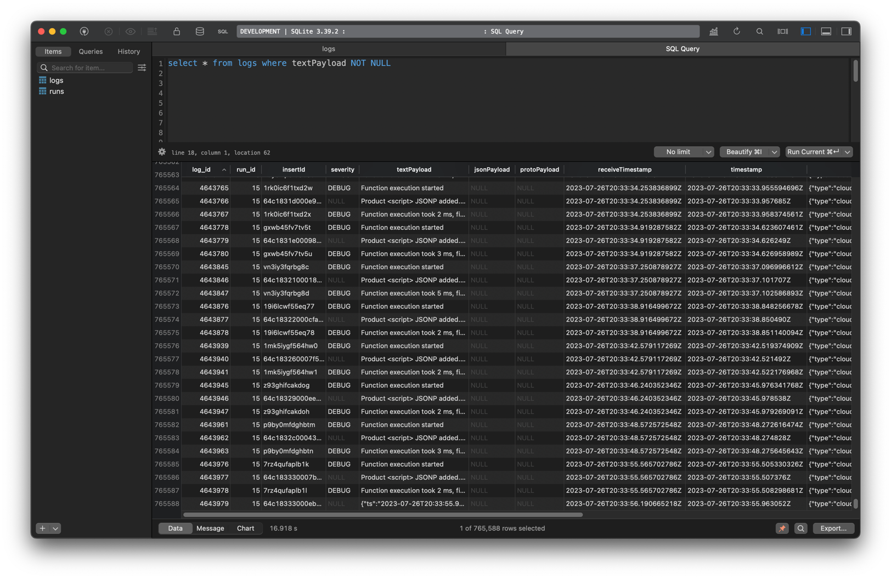

# lilo

`lilo` is a CLI to download and tail Google Cloud Platform logs to a SQLite database.


```bash
# Install
npm install -g bun
npm install -g lilo-cli

# Note: `gcloud` also needs to be installed and signed in. 

# Usage
lilo \
    --resource-names "projects/YOUR_GCP_PROJECT_ID_HERE" \
    --filter "timestamp > 2023-06-01" \
    --db ./db.sqlite \
    --watch 2000
```

See [`lilo help`](./src/lib-app/help.txt) for detailed flag docs.


- Log JSON values from your application and [ask questions later](https://youtu.be/YoVfMRkG0CE?t=407) with SQL queries.
	- Avoid creating a data schema for ad-hoc events/data when developing prototypes.
	- GCP Logging supports JSON lines - your application can log JSON lines to stdout.

- Use fast & familiar local tools.
	- Use a native GUI such as TablePlus for viewing tables.
	- Use SQLites SQL dialect instead of BigQuery.
	- SQLite [indexes on expressions](https://www.sqlite.org/expridx.html) can index a JSON path to speed up queries.
		- Like this: `create index i_01 on logs(jsonPayload ->> "$.msg")`
	- Use the SQLite CLI to query and pipe output JSON to Excel or other tools to create reports.
	- Any programming language that supports SQLite.
    - Fast interactivity for small to medium datasets.


- Avoid having to store large amounts of data forever in the cloud.
	- Set your Logging retention to one month, and use lilo to archive your data to a local SQLite DB.

- Query the db.sqlite on the server to respond to events.
	- Use polling SQL queries to observe events.

- Understand what's happening on your GCP account/audit logs.

- Convert the SQLite file to [DuckDB](https://duckdb.org/) for fast analytical queries.


Name origin: SQ<ins>Li</ins>te GCP <ins>Lo</ins>gs



*Example table schema and rows in TablePlus*


### FAQ

How long does it take to do a full download?

- It depends on how many logs you have, but by default GCP accounts are limited to 60 HTTP read calls per minute, and each of those has 1000 entries.
- `lilo` begins downloading from the last log entry it downloaded.
	- You can start and stop the CLI at any time.
	- `lilo` only downloads the log entries since the last run.


Why Bun?

- It has SQLite built in, so SQLite will not need to be compiled when installing `lilo` via NPM.
- I wanted to test it out.


### Alternatives & Notes

- Set up a log sink to BigQuery, then pipe a BigQuery query result to Google Sheets.


- Copy your existing logs to a Storage Bucket
	-  Use for log entries that were written before you set up a streaming log sink.
	-  https://cloud.google.com/logging/docs/routing/copy-logs


- https://cloud.google.com/logging/docs/samples/logging-tail-log-entries	

- https://cloud.google.com/logging/docs/reference/v2/rest/v2/entries/tail
	- The tail endpoint does not work with JSON, only GRPC.
	- Bun does not currently support GRPC, so `lilo` polls `entries:list`

- `gcloud alpha logging tail`

- https://til.simonwillison.net/cloudrun/tailing-cloud-run-request-logs


 